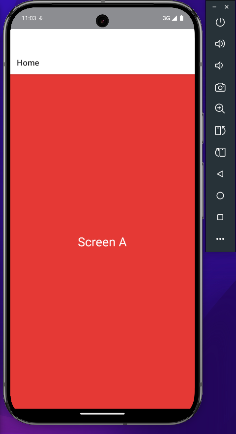
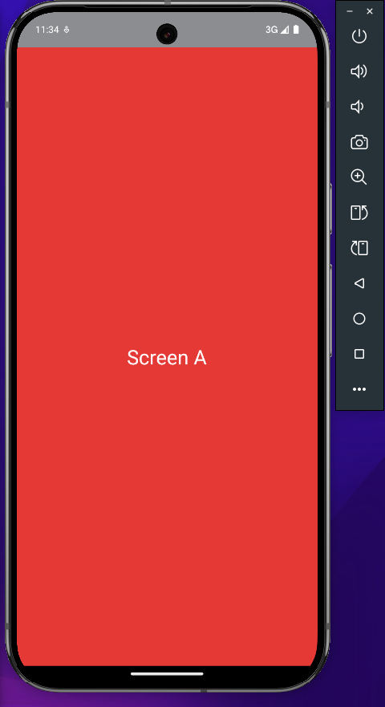

# `react-native-navigation`

## `NavigationContainer`

Todo e qualquer tipo de navegação, seja Stack, Drawer, Tabs, etc., precisa utilizar um componente chamado **`<NavigationContainer/>`**. Esse componente gerencia a árvore de navegação do projeto e contém o **estado de navegação**. Esse componente deve sempre envolver toda a estrutura de navegação. Geralmente é utilizado no App.

Exemplo:

```Javascript
export default function App() {
  return (
    <NavigationContainer>
      {/* some code about navigation here... */}
    </NavigationContainer>
  )
}
```

## `(Native) Stack Navigation`

Stack Navigation utiliza uma navegação que faz a transição entre uma tela e outra, onde, sempre que você troca de uma tela para outra, ela muda de posição na *pilha (stack)*. Ou seja, a tela que você está atualmente está na primeira posição da pilha, fazendo com que ela apareça para você. Essa é, basicamente, a navegação padrão de aplicativos mobile.

A opção que está sendo mostrada é a navegação em stack nativa, onde essa navegação utiliza componentes nativos do Android ou iOS para renderizar as coisas na tela, o que deixa mais fluído e rápido. A opção que não é native funciona, basicamente, da mesma forma. Porém, ela gerencia tudo com JavaScript, o que pode levar a problemas de performances, já que ele não utiliza tudo 100% nativo do dispositivo.

Exemplo:

```Javascript
import { createNativeStackNavigator } from '@react-navigation/native-stack';
import { NavigationContainer } from '@react-navigation/native';

const Stack = createNativeStackNavigator()

export default function App() {
  return (
    <NavigationContainer>
      <Stack.Navigator initialRouteName="home">
        <Stack.Screen
          name="home"
          component={Home}
          options={{
            title: 'Home'
          }}
        />
      </Stack.Navigator>
    </NavigationContainer>
  )
}
```

Resultado:



Para iniciar a navegação em Stack, você executa a função `createNativeStackNavigator()`, e essa função retornará dois componentes: `Navigator` e o `Screen`. 

O componente `Navigator` é o gerenciador principal da navegação em pilha, fazendo a organização e a renderização das telas que estão na pilha.

O componente `Screen` é componente que representa uma tela da pilha que o `Navigator` gerencia. Para funcionar, a `Screen` precisa de dois parâmetros obrigatórios:

- `name`: que é o identificador dessa tela na stack, muito similar ao definir uma rota em um projeto web.

- `component`: define o componente que será renderizado ao acessar essa tela na stack.

A propriedade `component` de `Screen` não é, necessariamente, obrigatória, mas é necessário que você informe qual componente será renderizado. E a outra forma de informar isso, é passando para o `Screen` o `children`, onde esse children deve ser uma função que retorna um componente. Veja no exemplo abaixo

```Javascript
import { createNativeStackNavigator } from '@react-navigation/native-stack';
import { NavigationContainer } from '@react-navigation/native';

const Stack = createNativeStackNavigator()

export default function App() {
  return (
    <NavigationContainer>
      <Stack.Navigator initialRouteName="home">
        <Stack.Screen
          name="home"
          options={{
            title: 'Home'
          }}
        >
          {(props) => <Home {...props}/>}
        </Stack.Screen>
      </Stack.Navigator>
    </NavigationContainer>
  )
}

```

Ao fazer de qualquer uma das formas, o componente que será renderizado na Screen receberá algumas propriedades referentes a navegação. Elas são o `navigation` e o `route`.

A propriedade `navigation` é responsável por permitir o roteamento de uma tela a outra e também passar parâmetros de uma tela para outra. Ainda baseado no exemplo acima que utilizamos um componente `Home`, esse seria o código dentro do componente home para utilizar a propriedade `navigation`:

```Javascript
export default function Home({ navigation }) {
  return (
    <View>
      <Button
        label="Go to other page"
        onPress={() => {
          navigation.navigate('OtherPage', {
            param1: true,
            param2: 200,
            param3: {
              name: 'john'
              lastName: 'doe',
              email: 'john.doe@mail.com'
            }
          });
        }}
      />
    </View>
  )
}
```

A função `navigate` fará o trabalho de navegar de uma tela para outra baseado no valor do `name` previamente definido. E, caso a rota precise de alguns parâmetros, o segundo argumento passado para a função são os parâmetros que serão recebidos pela próxima tela da stack que será renderizada.

Uma coisa muito importante de saber ao utilizar a função `navigate` para ir de uma tela para outra é que, caso você tenha um navigate que aponte para a tela que está renderizada atualmente na stack, o `navigate` não irá criar uma nova instância dessa tela. Ele sempre utilizará a mesma instância da tela para mostrar as coisas na tela. Caso os parâmetros mudem de um navigate para outro, os dados irão mudar, mas não criará uma nova instância da mesma tela que será renderizada na stack.

Porém, há uma função do `navigation` que possui o comportamento descrito anteriormente, que faz com que ao navegar de uma tela para outra, múltiplas instâncias da mesma tela na stack. Essa função se chama `push`. Ela funciona da mesma forma que o `navigate`, porém, caso você tenha uma navegação que leve para o mesmo componente atual da stack, ao navegar, será criada uma nova instância do mesmo componente na stack, apenas sobrepondo o antigo componente. Isso é muito interessante, por exemplo, em um app de e-commerce, onde, na página que mostra os dados de um produto, você liste outros produtos nela e ao usuário clicar nesse outro produto, ele seja redirecionado para a mesma tela, porém os dados do novo produto que ele está vendo. E caso ele queira voltar pro produto anterior, ele possa voltar normalmente.

```Javascript
export default function Home({ navigation }) {
  return (
    <View>
      <Button
        label="Go to other page"
        onPress={() => {
          navigation.push('Home', {
            param1: true,
            param2: 200,
            param3: {
              name: 'john'
              lastName: 'doe',
              email: 'john.doe@mail.com'
            }
          });
        }}
      />
    </View>
  )
}
```

Outra forma de utilizar o navigation é através do Hook `useNavigation`, que é uma forma mais moderna. E ficaria assim

```Javascript
export default function Home() {
  const navigation = useNavigation();

  return (
    <View>
      <Button
        label="Go to other page"
        onPress={() => {
          /* navigation.navigate('Home', {
            param1: true,
            param2: 200,
            param3: {
              name: 'john'
              lastName: 'doe',
              email: 'john.doe@mail.com'
            }
          }); */
          
          navigation.push('Home', {
            param1: true,
            param2: 200,
            param3: {
              name: 'john'
              lastName: 'doe',
              email: 'john.doe@mail.com'
            }
          });
        }}
      />
    </View>
  )
}
```

Utilizando os hooks, você tem a flexibilidade de acessar os dados de uma rota sem precisar está dentro do componente principal que é renderizado na rota, ou seja, sub componentes do seu componente podem acessar dados de uma rota.

Agora, sobre a propriedade `route`, ela possui os dados da rota atual, como o nome dela e, o mais importante de tudo, os parâmetros que ela recebeu. Para acessar os parâmetros que seu componente recebeu, é bem similar ao que fizemos com o `navigation`. Veja o exemplo abaixo:

```Javascript
export default function Home({ route }) {
  return (
    <View>
      <Text>{ route.name } { route.params }</Text>
    </View>
  )
}
```

Dessa você acessa o nome do componente e seus parâmetros, respectivamente. Os parâmetros podem ser de qualquer tipo, como mostrado no envio de parâmetros para rotas utilizando o `navigate`/`push`. E assim como existe o hook `useNavigation`, existe o `useRoute`:

```Javascript
export default function Home() {
  const route = useRoute();

  return (
    <View>
      <Text>{ route.name } { route.params }</Text>
    </View>
  )
}
```

<!--  -->

Também é possível definir algumas opções a mais para as Screens do projeto, como, por exemplo, um título para sua Screen, como foi já colocado no exemplo anterior. Se você não definir um título, por padrão, o título será o valor da propriedade `name`

Além do componente `Screen` receber parâmetros, o `Navigator` também recebe alguns parâmetros obrigatórios

- `initialRouteName`: esse parâmetro define que, ao iniciar determinada navegação em pilha, a primeira tela que deve ser renderizada em tela é a que possui o nome definido nesse parâmetro. No exemplo acima, a tela inicial que será renderizada será a rota com o `name` igual a **"home"**.

Como também visto no exemplo acima, essa navegação coloca uma espécie de cabeçalho que mostra o título da tela que está renderizada atualmente. Esse cabeçalho pode ser removido colocando o parâmetro `screenOptions` no componente `Navigator` da seguinte forma.


```Javascript
import { createNativeStackNavigator } from '@react-navigation/native-stack';
import { NavigationContainer } from '@react-navigation/native';

const Stack = createNativeStackNavigator()

export default function App() {
  return (
    <NavigationContainer>
      <Stack.Navigator
        initialRouteName="home"
        screenOptions={{
          headerShown: false,
        }}
      >
        <Stack.Screen
          name="home"
          component={Home}
          options={{
            title: 'Home'
          }}
        />
      </Stack.Navigator>
    </NavigationContainer>
  )
}
```

Por padrão, a propriedade `headerShown` de `screenOptions` vem como `true`, mas passando o valor `false` a tela final ficará assim:


